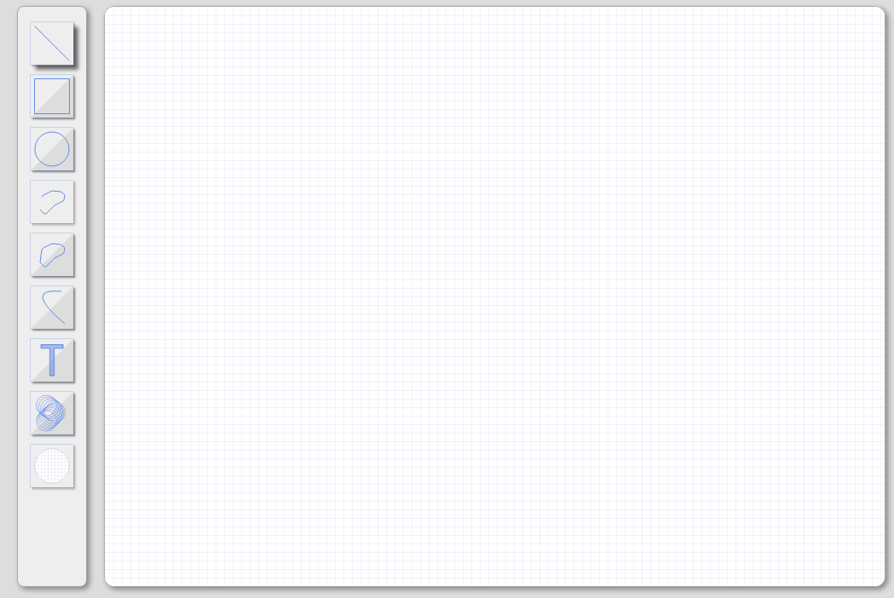

# canvas 学习重点和“坑点”总结

本文主要总结一下学习 canvas 过程中个人的一些心得，希望对将要学习 canvas，或者已经学习了一段时间 canvas 的小伙伴提供一些思路。文章主要按照时间顺序推进。

## 用属性设置 canvas 宽高

直接使用属性对 canvas 设置宽高`<canvas width="600" height="300"></canvas>`  
或者用 js 设置`canvas.width=600;canvas.height=300;`  
其实这两种方式是一样的，宽高不要写单位，html 中不管你写的什么单位，最终都以 px 为单位，而 js 写上单位宽高会变为 0。

不要使用 style 设置宽高，style 设置的宽高改变不了 dom 元素属性宽高。目前我知道的只有一种 img 元素，设置了样式宽高后，属性宽高也会变化。  
对别的元素来说，视觉上宽高正确就可以了。但是 canvas 不行，因为 canvas 的绘制是先以属性宽高绘制，绘制完后再放大到视觉宽高，所以相当于绘制的图形被缩放了。会有失真和比例不对的问题。

## 绘制的路径在调用 beginPath 前会一直存在

-   不会因为调用 stroke 而清除已绘制路径：一开始我想当然的认为画完一个路径并且 stroke 后就可以直接画下一个路径了，那么实际上之前绘制的路径还是存在的，再次调用 stroke 就画了所有路径，只不过如果你的绘制样式没改变的话重复绘制看不出效果而已

-   clearRect 不能清除路径：clearRect 是清除画布某区域的常用方法，但是它是不能清除路径的，在你调用 clearRect 后再调用 stroke 方法，之前的路径依然会被绘制。

-   canvas.width = canvas.width 可以清除路径：当想要清空整个画布时可以使用这种方式代替 clearRect。但是这种方式实际是重置了整个画布，不仅路径被清除，设置的其他绘制属性同样会被设为默认值。只想要清除路径时不太可能使用这个方法。所以绝大多数场景都是通过使用 beginPath 去清除之前画的路径。

## lineWidth 是奇数时画出的直线异常

-   问题：当线宽为奇数特别是 1 时画出的直线颜色和宽度都不正常。
-   分析：根本原因是 canvas 最小绘制单位是 1px，以及 canvas 画线方式决定。canvas 在画线时是以给定路径为中心，像两边延伸，各自延伸线宽的一半。如下第二副图所示  
      
    当我们画了一条(3,1) 到 (3,5) 的直线时，先以 y 坐标 3 为中心，然后两边各自画 0.5 个像素，正常来讲就是图二深蓝色部分。但是因为 canvas 最小绘制单位是 1 像素，而当前绘制的是 2.5-3.5 区域，所以 2-2.5 像素的区域也必须要绘制，结果就是 2-3 像素的区域会以给的颜色值平均分摊，视觉上颜色就变淡。3-4 同理。所以最终的宽度也由 1 像素变成了 2 像素。  
    为什么说这个问题在 1 像素中特别明显，首先是因为 1 像素变到 2 像素很直观，线宽越宽增加 1 像素感官上不明显，第二是因为画 1 像素时整个线条的颜色值都变化了，而画 3 像素或其他奇数像素时，只有边缘的半像素扩大并变淡了，中间的线条颜色还是设置的颜色。
-   解决办法：根据上面的分析，解决办法就是画直线时平移 0.5 像素，如上图 3 所示。即(3.5,1) 画至(3.5,5)。实际绘制的是横坐标 3-4 像素的垂直线。有个简便的操作可以直接 translate 半像素，就不用去动坐标值了。

## canvas中的变形

变形在canvas中是一个很实用的功能。它的种类和css一样，translate、rotate、scale。正因为两者比较类似，加上一开始对canvas理解地也不够，就错误地认为cavans中的变形会影响到之前绘制的图形。这是不对的。canvas中的图像一旦绘制出来，它就是一直保持那样了，除非清除后重绘或者直接在原有区域进行覆盖。

* translate是移动画布原点。画布默认的原点肯定是在(0,0)。使用translate后就可以将画布原点移动到其他坐标。很多时候这样是可以简化计算的，比方说上面提到的tranlate半像素，就不用去关注坐标值是多少了。第二个例子：
  
这是一个简单的绘制工具实例。左侧的工具栏也是纯canvas画出来的。每个工具图都在一个矩形框中。当在画这些工具框的时候，就是先用translate将坐标原点移动到工具框的左上顶点。这样有两个好处：一是外面的工具框可以完全复用，因为绘制矩形的x、y、width、height都一样了。否则的话x、y是需要重新计算的。第二就是简化绘制框内图形坐标的计算。

* 变形一般配合save和restore一起使用。save会保存cavans的所有状态，这个所有状态大致就分为：变形、样式属性、裁剪路径。前两个就不说了，裁剪路径后面单独讲一下。当你使用了多个变形，一个restore就直接恢复了，而不用一个一个去设置会初始值。在设置样式的时候，可能都不清楚初始值是多少。restore可以让我们不需要知道初始值。save和restore是可以嵌套使用的。

