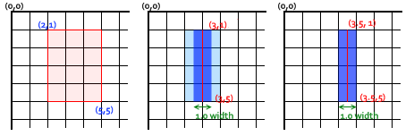

# canvas 学习重点和“坑点”总结

本文主要总结一下学习 canvas 过程中个人的一些心得，希望对将要学习 canvas，或者已经学习了一段时间 canvas 的小伙伴提供一些思路。文章主要按照时间顺序推进。

## 用属性设置 canvas 宽高

直接使用属性对 canvas 设置宽高`<canvas width="600" height="300"></canvas>`  
或者用 js 设置`canvas.width=600;canvas.height=300;`  
其实这两种方式是一样的，宽高不要写单位，html 中不管你写的什么单位，最终都以 px 为单位，而 js 写上单位宽高会变为 0。

不要使用 style 设置宽高，style 设置的宽高改变不了 dom 元素属性宽高。目前我知道的只有一种 img 元素，设置了样式宽高后，属性宽高也会变化。  
对别的元素来说，视觉上宽高正确就可以了。但是 canvas 不行，因为 canvas 的绘制是先以属性宽高绘制，绘制完后再放大到视觉宽高，所以相当于绘制的图形被缩放了。会有失真和比例不对的问题。

## 绘制的路径在调用 beginPath 前会一直存在

-   不会因为调用 stroke 而清除已绘制路径：一开始我想当然的认为画完一个路径并且 stroke 后就可以直接画下一个路径了，那么实际上之前绘制的路径还是存在的，再次调用 stroke 就画了所有路径，只不过如果你的绘制样式没改变的话重复绘制看不出效果而已

```
    ctx.lineWidth =20;
    ctx.strokeStyle = "rgba(0,255,0,0.5)"
    ctx.moveTo(50, 70)
    ctx.lineTo(350, 70);
    ctx.stroke();
    ctx.lineWidth = 2;
    ctx.strokeStyle = "black"
    ctx.moveTo(50, 100)
    ctx.lineTo(350, 100);
    ctx.stroke();
```

上面的代码绘制了两根水平线，第二次绘制前没调用 beginPath 那么绘制时会把第一次的路径也画进去。


-   clearRect 不能清除路径：clearRect 是清除画布某区域的常用方法，但是它是不能清除路径的，在你调用 clearRect 后再调用 stroke 方法，之前的路径依然会被绘制。

-   canvas.width = canvas.width 可以清除路径：当想要清空整个画布时可以使用这种方式代替 clearRect。但是这种方式实际是重置了整个画布，不仅路径被清除，设置的其他绘制属性同样会被设为默认值。只想要清除路径时不太可能使用这个方法。所以绝大多数场景都是通过使用 beginPath 去清除之前画的路径。

## lineWidth 是奇数时画出的直线异常

-   问题：当线宽为奇数特别是 1 时画出的直线颜色和宽度都不正常。
-   分析：根本原因是 canvas 最小绘制单位是 1px，以及 canvas 画线方式决定。canvas 在画线时是以给定路径为中心，像两边延伸，各自延伸线宽的一半。如下第二副图所示  
      
    当我们画了一条(3,1) 到 (3,5) 的直线时，先以 y 坐标 3 为中心，然后两边各自画 0.5 个像素，正常来讲就是图二深蓝色部分。但是因为 canvas 最小绘制单位是 1 像素，而当前绘制的是 2.5-3.5 区域，所以 2-2.5 像素的区域也必须要绘制，结果就是 2-3 像素的区域会以给的颜色值平均分摊，视觉上颜色就变淡。3-4 同理。所以最终的宽度也由 1 像素变成了 2 像素。  
    为什么说这个问题在 1 像素中特别明显，首先是因为 1 像素变到 2 像素很直观，线宽越宽增加 1 像素感官上不明显，第二是因为画 1 像素时整个线条的颜色值都变化了，而画 3 像素或其他奇数像素时，只有边缘的半像素扩大并变淡了，中间的线条颜色还是设置的颜色。
-   解决办法：根据上面的分析，解决办法就是画直线时平移 0.5 像素，如上图 3 所示。即(3.5,1) 画至(3.5,5)。实际绘制的是横坐标 3-4 像素的垂直线。有个简便的操作可以直接 translate 半像素，就不用去动坐标值了。

## canvas 中的变形

变形在 canvas 中是一个很实用的功能。它的种类和 css 一样，translate、rotate、scale。正因为两者比较类似，加上一开始对 canvas 理解地也不够，就错误地认为 cavans 中的变形会影响到之前绘制的图形。这是不对的。canvas 中的图像一旦绘制出来，它就是一直保持那样了，除非清除后重绘或者直接在原有区域进行覆盖。

-   translate 是移动画布原点。画布默认的原点肯定是在(0,0)。使用 translate 后就可以将画布原点移动到其他坐标。很多时候这样是可以简化计算的，比方说上面提到的 tranlate 半像素，就不用去关注坐标值是多少了。translate 还有一个很重要的作用就是配合 rotate 和 scale 使用。rotate 是按照 cavas 原点旋转的，默认情况下就是以(0,0)为中心旋转。这个在很多时候显然是无法满足需求的。  
      
    比方说这个时钟动画。简单说下实现原理，静态的东西就不说了， 就说说需要转动的三个指针，首先全部指在 0 点。然后根据当前时刻获取到时分秒，再做一定比例的旋转就可以了。那么再旋转变形的时候，就得把画布原点 translate 到时钟中心。如果不用 rotate 每次重绘的时候就需要去计算坐标，首先按照当前时刻计算出旋转的角度（rotate 到这一步就完成了），然后用三角函数算出终点(x,y)，才能绘制从圆心到终点的一条直线。如果没用 translate 还需要加上相对 canvas 左上角的坐标。很明显使用变形过后工作量降低了，这还只是很简单的动画。scale 其实也是类似，需要注意的就是使用前移动画布原点。canvas 中的 rotate 和 scale 是可以参照 css3 变形的，变形原点设置到 transform-origin 的地方，后面的效果是完全一样的。包括 sacle 如果设置为负值，可以产生镜像变换的效果。

-   变形一般配合 save 和 restore 一起使用。save 会保存 cavans 的所有状态，这个所有状态大致就分为：变形、样式属性、裁剪路径。前两个就不说了，裁剪路径后面单独讲一下。当你使用了多个变形，一个 restore 就直接恢复了，而不用一个一个去设置会初始值。在设置样式的时候，可能都不清楚初始值是多少。restore 可以让我们不需要知道初始值。save 和 restore 是可以嵌套使用的。就像有个数组，调用一次 save 就往这个数组里 push 进一个状态，restore 后又把数组最后一个元素 pop 出来作为当前状态。

## 关于路径

路径之前说过清除的问题。还有两点这里谈一下。一个就是之前提到过的裁剪路径 clip，另外一个分享一下 isPointInPath 方法。灵活运用这两个方法同样可以带来便捷。

-   裁剪路径 clip 后，canvas 上的绘制都只针对裁剪后的区域生效，clip 针对的是最近的一次路径绘制。默认裁剪的是整块画布。 比方说要绘制下面这个图形，即在圆形区域内的网格。
      
    如果不用 clip 要怎么绘制呢？可能又是需要做许多复杂的运算吧。运用 clip 后就变得非常简单了：绘制一个圆调用 clip，然后就可以放心大胆的画网格了，直接针对整个画布绘制即可，最终只有被裁剪区域才会被绘制，注意，调用 clip 前后必须使用 save 和 restore，否则你就变不回去了,绘制的区域只会越来越小。再举一个例子，clearRect 是清楚画布模块区域的常用方法，但是这样只能清除矩形，如果想清除圆形或者其他区域呢？也是使用 clip 就可以了。只想清除圆形的话就先绘制圆形的路径，然后调用包含这个路径区域的 clearRect 即可。其他形状同理。当然直接用背景色覆盖这个区域也是可以的，但是这和 clearRect 还是不同的，clearRect 后这块区域变成了透明的黑色。覆盖是不可能用透明色去覆盖的。

-   isPointInPath 是判断当前点位是否在绘制路径中，也是最近的一次绘制路径。这个方法呢在交互的时候使用的会比较多。
    
    这是一个简答的绘制工具，图中展示了绘制二次贝塞尔曲线的二种情况，一种就是拖动了小球即控制点，那么相应地就回去绘制贝塞尔曲线。如果没有点击到小球，那么就是去另一个地方绘制贝塞尔曲线。这里就需要去判断鼠标是否在小球内 mouseDown 了。这个时候就可以运用 isPointInPath 方法了，注意小球路径必须为调用方法前的最后绘制路径。这里如果不用这个方法，也是不易判断的，但是圆形其实还是可以判断，大家有没有思路？

    这两个方法在非规则图形中效果更加明显，像圆形三角形其实凭借运算还是可以算出来的，但是如果是更复杂的非规则图形，带曲线图形。那就真的很难计算了。

## 合成图形 globalCompositeOperation

globalCompositeOperation 属性主要就是用来设置已绘图形和新绘图形的合成方式。默认很明显地就是新图形覆盖老图形，新图形的层级比较高，默认值 source-over。那肯定也可以设置新绘制图形在老图形之下。这时候 globalCompositeOperation 的值为 destination-over。

使用场景就是这个例子中的选中效果，选中后给框框增加了一个阴影。这里设置阴影时我需要绘制一下矩形，那么正常情况下这个绘制的矩形就会覆盖我原有的矩形，所以我在这里设置了一下 globalCompositeOperation 为 destination-over，这样和原有矩形重叠的区域就在下方，视觉上看到的就只有不重叠的阴影而已。  
globalCompositeOperation 还有一些常用的值可以用来组合出一些新图形，比如说下面就是用 globalCompositeOperation 的 source-out 合成的月亮。source-out 就是说新图形 out 部分即不重叠部分被绘制。

 

其他的值也可以组合出其他效果，我就不罗列了，因为我自己也没有场景去使用过。大家想了解的大可以去网上搜到。

## 性能

最后关于 canvas 性能，我说下我个人的看法。如果图形你只绘制了一遍，那么你可以不用太关注性能。因为以现代浏览器的性能，不管你的图形有多么复杂，绘制一遍对它来说都是小儿科。只有当你的图形需要频繁重绘，比方说动画或者有交互像鼠标移动事件等的时候我们才需要考虑性能。

我认为性能上最关键的就是不要重复绘制 canvas 静态部分，这里可以再看下那个时钟动画。除了指针其他都是一经画好就不需要动的。那么有几张方式，首先能使用多层画布就尽量使用多层画布，这个例子中除了指针外的其他东西可以放在底层互画布上，指针呢画在上层画布上，这种性能是最好的。还有两种呢第一是使用离屏 cavans，就是再创建一个 canvas 元素，将静态的图画到这个 canvas 上后再使用 drawImage 方法将这个 canvas 的内容渲染到展示的 canvas 中。还有一种就是使用 ImageData 保存 canvas 的当前画面，ImageData 是像素级别的保存，在 canvas 每一个像素点上保存 rgba 值。具体到这个例子中就是再绘制指针前将保存的 ImageData 赋值给 canvas。
